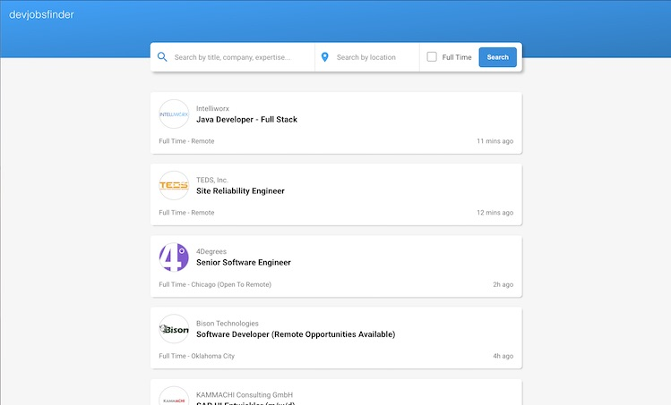
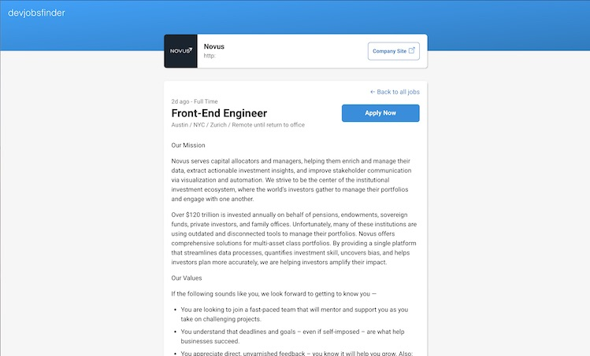

# Dev Jobs Finder - Next.js App using GitHub's Jobs API

## Table of contents

- [Deprecation Note](#deprecation-note)
- [Screenshots](#screenshots)
- [My process](#my-process)
  - [Built with](#built-with)
  - [What I learned](#what-i-learned)
  - [Continued development](#continued-development)
- [Author](#author)

## Deprecation Note
I built this app as a way to practice my frontend development skills. I completed it before the GitHub Jobs API was deprecated, and sadly, that project has now [finished its life](https://github.blog/changelog/2021-04-19-deprecation-notice-github-jobs-site/). So I'll be taking the live demo down for the time being. However, in the future I may update this project if I find another free and open source job listings API. Either way, I enjoyed making this project, and it served as great practice for my increasing my frontend development skills.

### Screenshots
#### Search Page

#### Job Details Page

## My process

### Built with

- [Next.js](https://nextjs.org/) - React framework
- [React](https://reactjs.org/) - JS library
- [TypeScript](https://www.typescriptlang.org/) - For writing more explicit and reliable code
- [useSWR](https://swr.vercel.app/) - For making data handling fast, efficient, and simple
- [date-fns](https://date-fns.org/) - For formatting date strings
- Lambdas (Serverless functions)
- Semantic HTML5 markup
- CSS Modules & CSS-in-JS
- Mobile-first design & workflow
- React hooks

### What I learned

My goal for this project was to build my Next.js chops while also trying out a few patterns and libraries I haven't worked with before like CSS Modules, [useSWR](https://swr.vercel.app/), and [date-fns](https://date-fns.org/).

Making use of [useSWR](https://swr.vercel.app/), was very enjoyable. It made setting up requests from the UI super easy. I can see myself using this again in other projects.

### Continued development

While I've implemented the ability to load more jobs indefinitely, I should still improve performance by limiting the amount of rendered items on screen. I would 
also like to add a dark mode option to the application.

## Author

- My Portfolio - [Matthias 'Matthias' Smith](https://portfolio-matthiassmith.vercel.app)
- GitHub - [GitHub Profile](https://github.com/MatthiasSmith)
